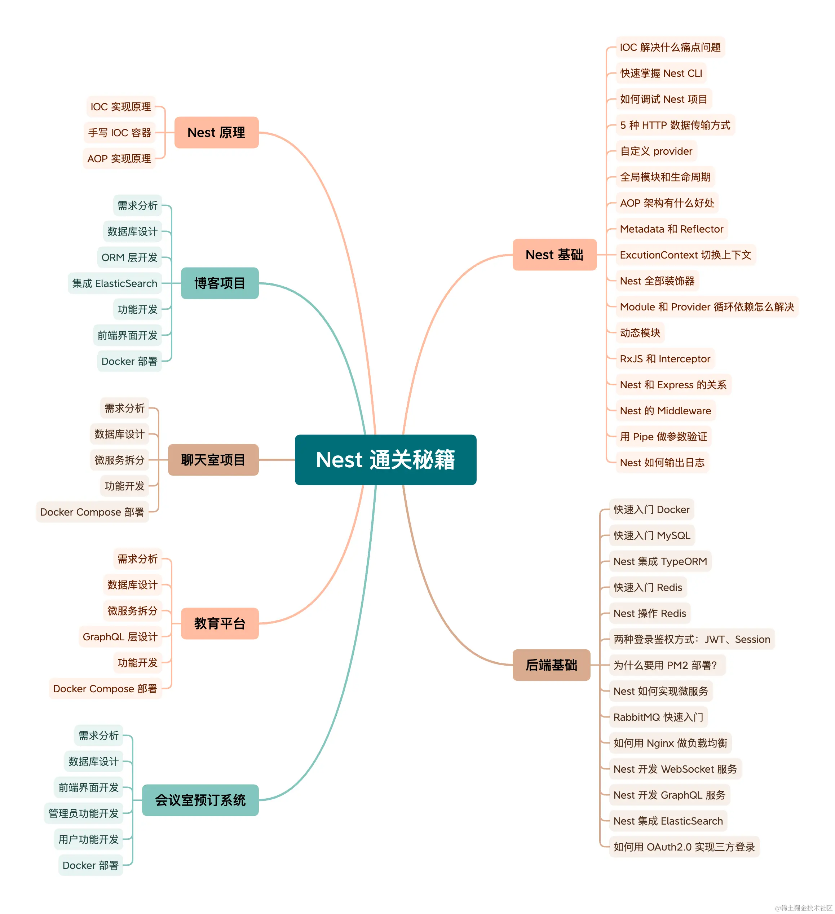

# Nest 通关秘籍

[文档地址](https://nest-docs.liushuaiyang.com)

## 你将获得
- 全面掌握 Nest，深入实现原理；
- 10+ 后端数据库、中间件使用指南；
- 6+ 完整全栈项目开发流程及代码；
- 前后端独立开发及容器部署经验。

想要从前端工程师进阶成为全栈工程师，Nest 是目前一个很好的选择。

它是 Node 最流行的企业级开发框架，提供了 IOC、AOP、微服务等架构特性。这让 Nest 可以独立部署，更易于维护和测试。而且，Nest 是用 TypeScript 编写的，对于缺少后端编程经验的前端开发者来说，使用体验也非常友好。

这里重点介绍下小册中的项目实操：

✅会议室预订系统 ：这是一个单体应用，主要是练习使用 MySQL + TypeORM + Redis + Docker + Nest 进行开发。

✅电商系统 ：这是微服务架构的项目，练习使用 RabbitMQ + MySQL + Redis + Docker Compose + etcd + Nest 进行开发。

✅聊天室项目 ：这是 WebSocket 项目，练习使用 WebSocket + MongoDB + Redis + Docker Compose + Nginx + Nest 进行开发。

✅教育平台 ：这是 GraphQL 项目，练习使用 GraphQL + MongoDB + Redis + Kafaka + Docker Compose + Nginx + Nest 进行开发。

✅博客项目 ：这个是 ElasticSearch 项目，练习使用 ElasticSearch + MySQL + Redis + Docker Compose + Nginx + Nest 进行开发。

相信，有了这些实战的历练，大家可以成为一个真正意义上的全栈工程师！

## 适宜人群
- 想进阶全栈的前端工程师；
- 想学习 Nest 的 JS 工程师；
- 想学习 MySQL、Redis、RabbitMQ 等后端中间件的 JS 工程师；
- 想学习 Docker、Docker Compose 部署方案的 JS 工程师。