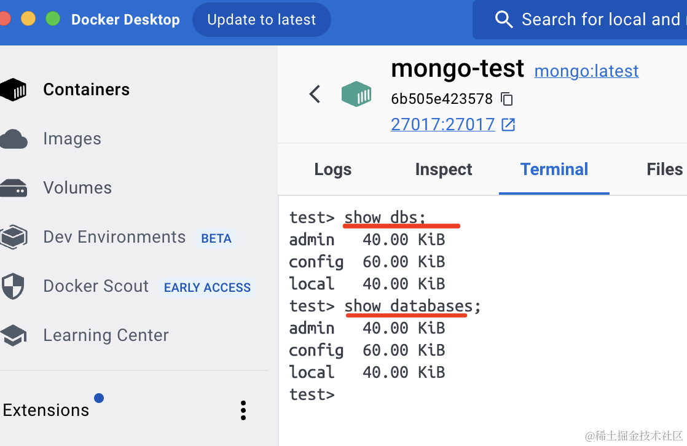
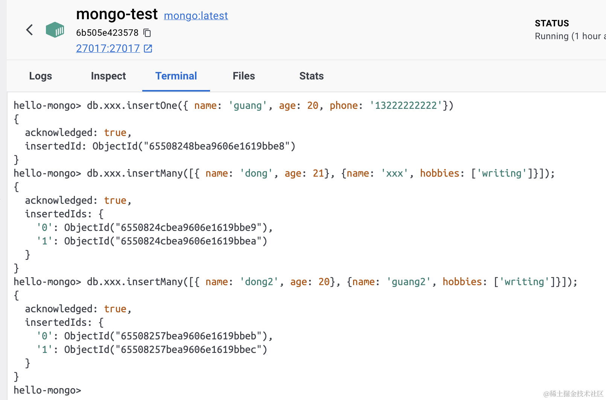
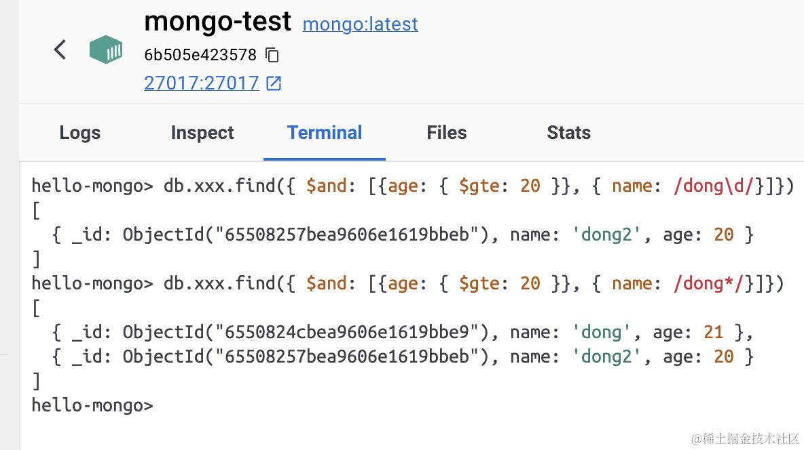
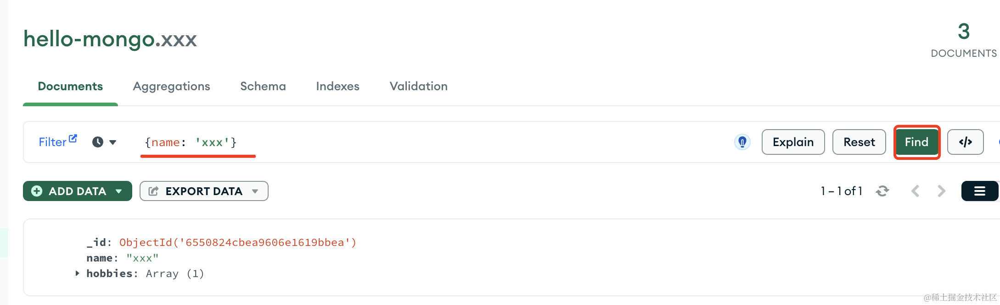

数据库我们学习了 mysql，这节来再来学下 mongodb。

在 docker desktop 搜索 mongo 镜像，然后把它跑起来：


指定容器名、映射的端口号，以及挂载到 /data/db 的本地目录：


这个本地目录是本地的任何一个目录都行，用来存放 mongodb 的数据的。


跑起来之后，进入 terminal，开始学习 mongodb 的 crud：


输入 mongosh，就可以敲 mongo 命令了：

```
show dbs;
show databases;
```



查看下现有的 database。

和 mysql 一样，mongodb 也是通过一个个 database 来存储不同数据的，只不过 mysql 的 database 里存的是 table，而 mongo 里存的是 Collection。


创建或者切换 database 用 use 

```
use hello-mongo;
```
然后 db 命令查看当前 database：

```
db;
```


但这时候你再用 show dbs 会发现没有这个 db：


这是因为默认有了一个 collection 之后才会把 database 写入硬盘。

```
db.createCollection('aaa');
```

创建了一个 collection 之后，再次 show dbs，这时候就看到这个新的 database 了：


如果你想删除 database，用这个命令：

```
db.dropDatabase();
```


创建和删除 database 我们会了，然后是 collection：


用 db.createCollection 创建 db，然后可以用 db.xxx.drop() 删掉。

接下来向 collection 中插入几个 document：

```
db.xxx.insertOne({ name: 'guang', age: 20, phone: '13222222222'});

db.xxx.insertMany([{ name: 'dong', age: 21}, {name: 'xxx', hobbies: ['writing']}]);

db.xxx.insertMany([{ name: 'dong2', age: 20}, {name: 'guang2', hobbies: ['writing']}]);
```



可以看到，插入的数据可以是任意结构的，这就是 mongodb 和 mysql 的最大区别。

不像 mysql 只能在 table 里存结构化的记录一样，mongodb 的 collection 里可以存任意结构的 document。

再就是 mysql 是需要用 sql 来 crud 的，而 mongodb 里是用 api。

但完成的功能是一样的，可以在 [mongodb 文档](https://www.mongodb.com/docs/mongodb-shell/crud/)里看到每个 api 的介绍下面都有对应的 sql 写法：


我们试下查询：

```
db.xxx.find({age: 20});

db.xxx.findOne({ age: 20});
```


find 是查询多条记录，而 findOne 只返回第一条。

当不传过滤条件的时候，就是返回所有的 Document：

```
db.xxx.find()
```


查询条件有多个值的时候这样写，类似 sql 的 in：

```
db.xxx.find({ age: { $in: [20, 21]}})
```


in 是包含， nin 是不包含。

类似 in 的还有 gt（great than）、lt（less than）、gte（great than equal ）、lte（less than equal ）、ne（not equal）


多个条件的时候用 and：

```
db.xxx.find({ $and: [{age: { $gte: 20 }}, { name: /dong\d/}]})

db.xxx.find({ $and: [{age: { $gte: 20 }}, { name: /dong*/}]})
```
搜索 age 大于等于 20，并且名字包含 dong 的 Document，这里用的正则做的模糊匹配：



用 or 的话就是两个条件满足一个就行：

```
db.xxx.find({ $or: [{age: { $gt: 20 }}, { name: /dong*/}]})
```


分页用的是 skip 和 limit 方法：

```
db.xxx.find().skip(1).limit(2)
```
从第一条 Document 开始，取 2 条：


更新的话用 updateOne、updateMany 方法：

```
db.xxx.updateOne({ name: 'guang'}, { $set: {age: 30} })
```


如果在更新的时候带上时间戳，可以用 $currentDate：

```
db.xxx.updateOne({ name: 'guang'}, { $set: {age: 30}, $currentDate: { aaa: true } })
```


如果你想替换整个的 document，那么用 replaceOne：

```
db.xxx.replaceOne({name: 'guang'}, { age: 30})
```


删除的话，也有 deleteOne 和 deleteMany 两个方法：

```
db.xxx.deleteMany({ age: { $gt: 20 }});
```


此外，还有 count 可以计数：

```
db.xxx.count()

db.xxx.count({ name: /guang/})
```


sort 可以排序，1 是升序、-1 是降序：

```
db.xxx.find().sort({ age: -1})
```

按照 age 降序：


```
db.xxx.find().sort({ age: -1, name: 1})
```

先按照 age 降序，再按照 name 升序：


这样，CRUD 我们都过了一遍。

当然，这些操作也都可以在 GUI 里可视化的搞，这样就不用敲命令了：

下载官方 GUI 工具 [Mongo Compass](https://www.mongodb.com/products/tools/compass)：


连接上 mongodb 的 server：


在 GUI 工具里操作就很方便直观了：


可以看到所有的 database、collection、document。

在这里输入过滤条件后点击 find：



更新和删除也都很直观：


## 总结

这节我们入门了 mongodb。

它的 database 下是 collection，collection 包含多个 document。

document 可以是任意结构的，这点和 mysql 的 table 不同。

mongo 是通过 api 来做 CRUD 的，不是用的 sql。

我们过了一遍常用的命令和 api：

```
show dbs; // 显示 database
show databases;

use hello-mongo; // 切换或者创建 database

db; // 查看当前 database

db.dropDatabase(); // 删除 database

db.createCollection('aaa'); // 创建 collection

db.xxx.drop() //删除 collection

db.xxx.insertOne({ name: 'guang', age: 20, phone: '13222222222'});// 插入 document

db.xxx.insertMany([{ name: 'dong', age: 21}, {name: 'xxx', hobbies: ['writing']}]);

db.xxx.find({age: 20}); // 查询 collection

db.xxx.findOne({ age: 20});

db.xxx.findOne(); // 查询所有 collection

db.xxx.find({ age: { $in: [20, 21]}}) // 使用 in、nin 查询多个值

db.xxx.find({ $and: [{age: { $gte: 20 }}, { name: /dong\d/}]}) // 使用 and 指定多个条件同时成立

db.xxx.find({ $or: [{age: { $gt: 20 }}, { name: /dong*/}]}) // 使用 or 表示或者

db.xxx.find().skip(1).limit(2) // 使用 skip + limit 实现分页

db.xxx.updateOne({ name: 'guang'}, { $set: {age: 30}, $currentDate: { aaa: true } }) // updateOne、updateMany 更新

db.xxx.replaceOne({name: 'guang'}, { age: 30}) // 整体替换

db.xxx.deleteMany({ age: { $gt: 20 }}); // deleteOne、deleteMany 删除

db.xxx.count({ name: /guang/})

db.xxx.find().sort({ age: -1, name: 1})
```
当然，平时不用敲 api，用 Mongo Compass 的 GUI 工具操作非常简单。
