Exception Filter 是在 Nest 应用抛异常的时候，捕获它并返回一个对应的响应。

比如路由找不到时返回 404：

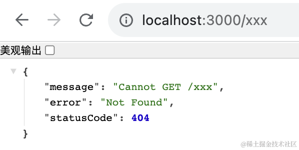

服务端报错时返回 500：


参数的错误返回 400：


这些都是 Exception Filter 做的事情。

那么，如果我们想自定义异常时返回的响应格式呢？

这种就要自定义 Exception Filter 了。

创建个 nest 项目：

```
nest new exception-filter-test
```


把它跑起来：

```
npm run start:dev
```


浏览器访问 http://localhost:3000 可以看到 hello world，代表服务跑起来了：


然后在 controller 里抛个异常： 


```javascript
throw new HttpException('xxxx', HttpStatus.BAD_REQUEST)
```
这个 HttpStatus 就是一些状态码的常量：

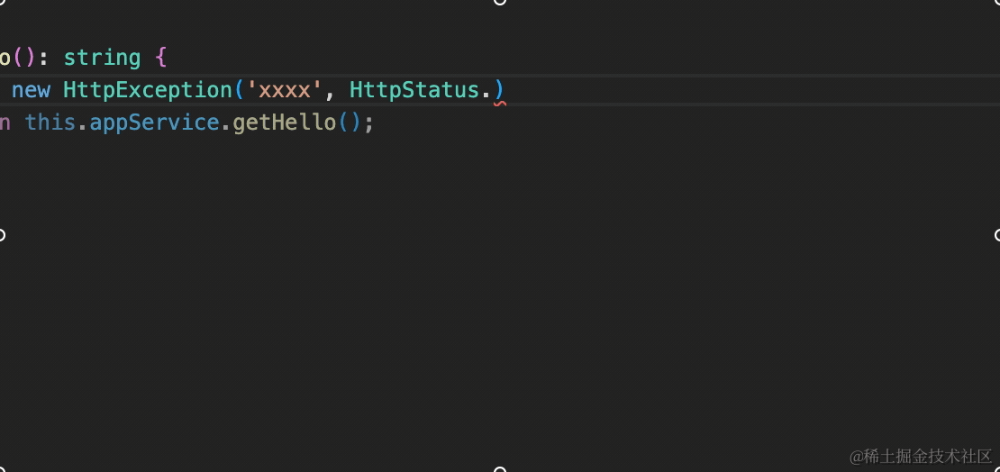

这时候刷新页面，返回的就是 400 对应的响应：

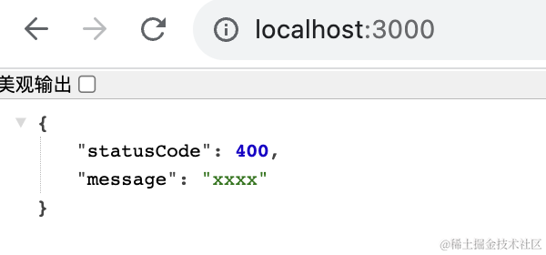

这个响应的格式是内置的 Exception Filter 生成的。

当然，你也可以直接抛具体的异常：


然后我们自己定义个 exception filter：

```
nest g filter hello --flat --no-spec
```

--flat 是不生成 hello 目录，--no-spec 是不生成测试文件。


@Catch 指定要捕获的异常，这里指定 BadRequestException。


```javascript
import { ArgumentsHost, BadRequestException, Catch, ExceptionFilter } from '@nestjs/common';

@Catch(BadRequestException)
export class HelloFilter implements ExceptionFilter {
  catch(exception: BadRequestException, host: ArgumentsHost) {
    debugger;
  }
}
```
先打个断点。

在 AppModule 里引入：

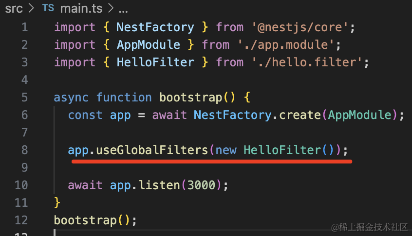

```javascript
app.useGlobalFilters(new HelloFilter());
```
如果你想局部启用，可以加在 handler 或者 controller 上：


然后新建个调试配置文件：


输入调试配置：


```json
{
    "type": "node",
    "request": "launch",
    "name": "debug nest",
    "runtimeExecutable": "npm",
    "args": [
        "run",
        "start:dev",
    ],
    "skipFiles": [
        "<node_internals>/**"
    ],
    "console": "integratedTerminal",
}
```
把之前的服务关掉，点击调试启动：

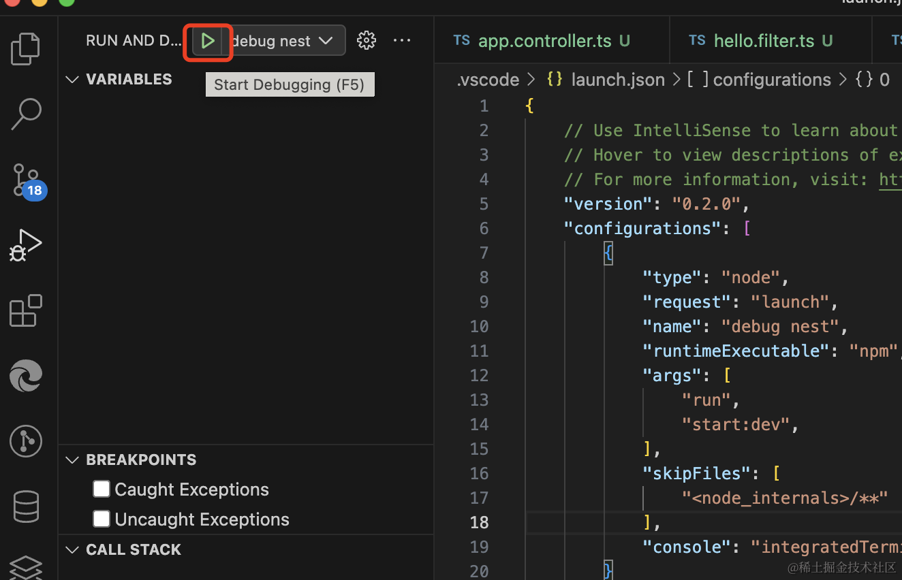

刷新页面，代码会在断点处断住：

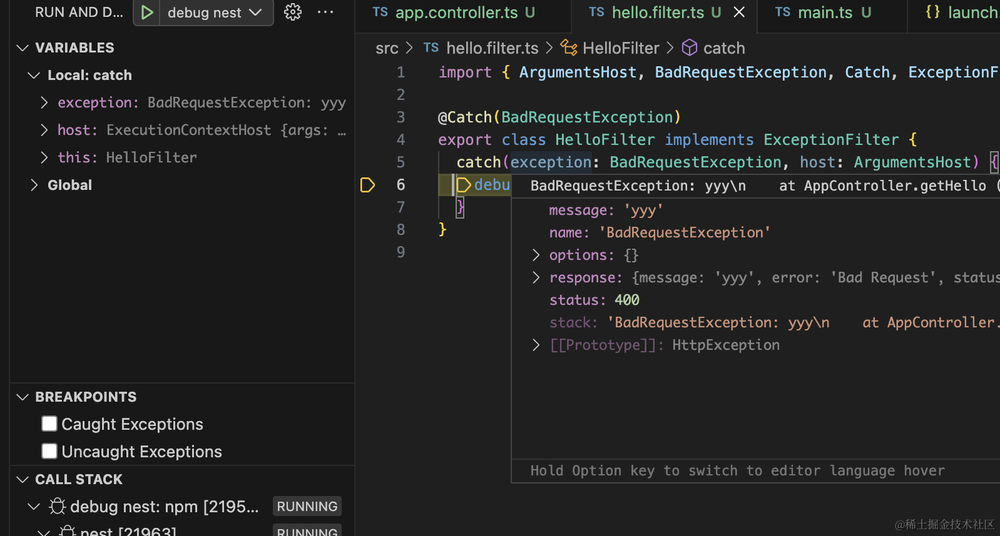

我们只要根据异常信息返回对应的响应就可以了：

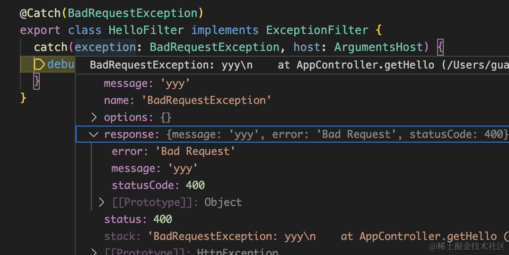

```javascript
import { ArgumentsHost, BadRequestException, Catch, ExceptionFilter, HttpException } from '@nestjs/common';
import { Response } from 'express';

@Catch(BadRequestException)
export class HelloFilter implements ExceptionFilter {
  catch(exception: BadRequestException, host: ArgumentsHost) {
    const http = host.switchToHttp();
    const response = http.getResponse<Response>();

    const statusCode = exception.getStatus();

    response.status(statusCode).json({
       code: statusCode,
       message: exception.message,
       error: 'Bad Request',
       xxx: 111
    })
  }
}

```
这样，抛异常时返回的响应就是自定义的了：


但我们只是 @Catch 了 BadRequestException

如果抛的是其他异常，依然是原来的格式：

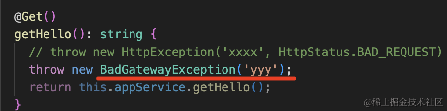

比如我抛一个 BadGatewayException。


依然是默认格式。

那我们只要 @Catch 指定 HttpException 不就行了？

因为 BadRequestExeption、BadGateWayException 等都是它的子类。


试一下：


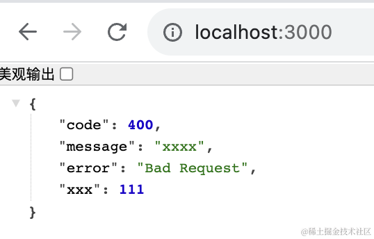

确实，现在所有的 HttpException 都会被处理了。

但其实这也有个问题。

就是当我们用了 ValidationPipe 的时候。

比如我们加一个路由：

```javascript
@Post('aaa') 
aaa(@Body() aaaDto: AaaDto ){
    return 'success';
}
```
然后创建 src/aaa.dto.ts

```javascript
export class AaaDto {
    aaa: string;
    
    bbb: number;
}
```
安装用到的包：

```
npm install --save class-validator class-transformer
```
然后给 AaaDto 添加几个校验规则：

```javascript
import { IsEmail, IsNotEmpty, IsNumber } from "class-validator";

export class AaaDto {
    @IsNotEmpty({message: 'aaa 不能为空'})
    @IsEmail({}, {message: 'aaa 不是邮箱格式'})
    aaa: string;
    
    @IsNumber({}, {message: 'bbb 不是数字'})
    @IsNotEmpty({message: 'bbb 不能为空'})
    bbb: number;
}
```
在 main.ts 启用 ValidationPipe：


```javascript
app.useGlobalPipes(new ValidationPipe());
```

在 postman 里测试下：


可以看到，提示的错误也不对了。

因为我们自定义的 exception filter 会拦截所有 HttpException，但是没有对这种情况做支持。

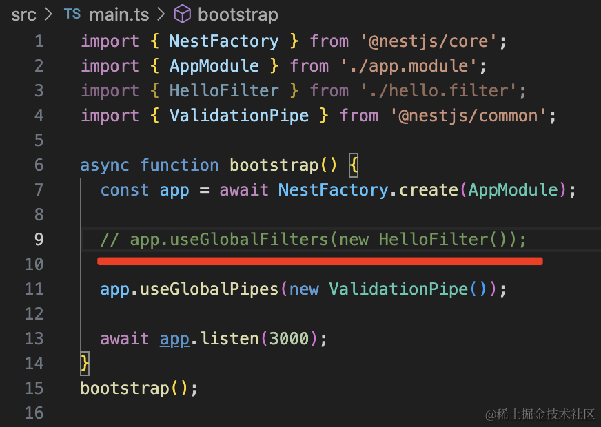

先不加这个 filter。

这时候响应是这样的：


我们对这种情况做下支持：

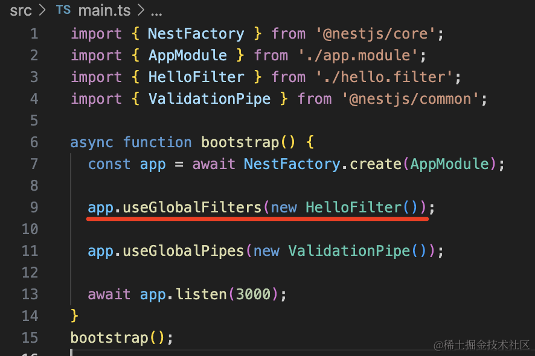

启用自定义的 filter，然后打个断点：


再次访问会在断点处断住：


可以看到 ValidationPipe 的 response 格式是这样的。

所以我们可以这样改：


```javascript
import { ArgumentsHost, BadRequestException, Catch, ExceptionFilter, HttpException } from '@nestjs/common';
import { Response } from 'express';

@Catch(HttpException)
export class HelloFilter implements ExceptionFilter {
  catch(exception: HttpException, host: ArgumentsHost) {
    const http = host.switchToHttp();
    const response = http.getResponse<Response>();

    const statusCode = exception.getStatus();

    const res = exception.getResponse() as { message: string[] };
    
    response.status(statusCode).json({
       code: statusCode,
       message: res?.message?.join ? res?.message?.join(',') : exception.message,
       error: 'Bad Request',
       xxx: 111
    })
  }
}
```

如果 response.message 是个数组，就返回 join 的结果，否则还是返回 exception.message

再试下：


现在，ValidationPipe 的错误和其他的错误就都返回了正确的格式。

那如果我想在 Filter 里注入 AppService 呢？

这就需要改一下注册方式：

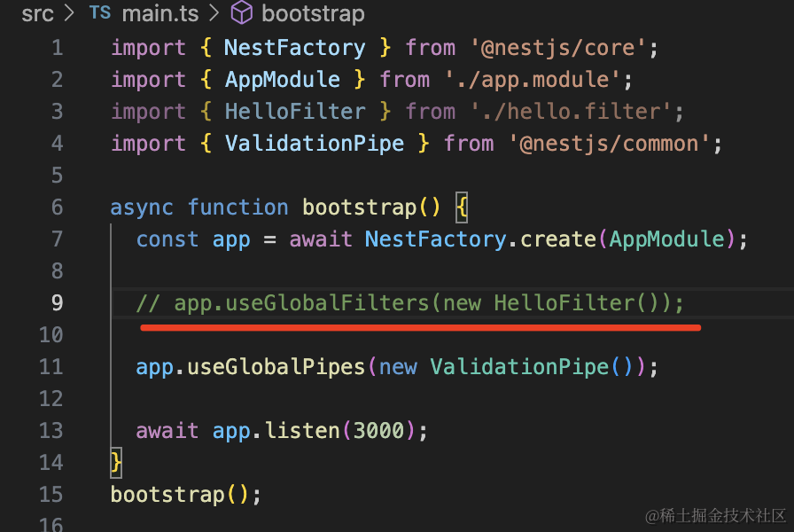

不用 useGlobalFilters 注册了，而是在 AppModule 里注册一个 token 为 APP_FILTER 的 provider：


```javascript
{
  provide: APP_FILTER,
  useClass: HelloFilter
}
```
Nest 会把所有 token 为 APP_FILTER 的 provider 注册为全局 Exception Filter。

注册多个 Filter 也是这么写。

其余的全局 Guard、Interceptor、Pipe 也是这样注册：


这样注册的好处就是可以注入其他 provider 了：

比如我注入了 AppService，然后调用它的 getHello 方法：


```javascript
import { ArgumentsHost, BadRequestException, Catch, ExceptionFilter, HttpException, Inject } from '@nestjs/common';
import { Response } from 'express';
import { AppService } from './app.service';

@Catch(HttpException)
export class HelloFilter implements ExceptionFilter {

  @Inject(AppService)
  private service: AppService;

  catch(exception: HttpException, host: ArgumentsHost) {
    const http = host.switchToHttp();
    const response = http.getResponse<Response>();

    const statusCode = exception.getStatus();

    const res = exception.getResponse() as { message: string[] };
    
    response.status(statusCode).json({
       code: statusCode,
       message: res?.message?.join ? res?.message?.join(',') : exception.message,
       error: 'Bad Request',
       xxx: 111,
       yyy: this.service.getHello()
    })
  }
}
```
可以看到，service 方法调用成功了：


此外，如果你想自定义 Exception 也是可以的。

比如添加一个 src/unlogin.filter.ts 

```javascript
import { ArgumentsHost, Catch, ExceptionFilter, HttpStatus } from '@nestjs/common';
import { Response } from 'express';

export class UnLoginException{
  message: string;

  constructor(message?){
    this.message = message;
  }
}

@Catch(UnLoginException)
export class UnloginFilter implements ExceptionFilter {
  catch(exception: UnLoginException, host: ArgumentsHost) {
    const response = host.switchToHttp().getResponse<Response>();

    response.status(HttpStatus.UNAUTHORIZED).json({
      code: HttpStatus.UNAUTHORIZED,
      message: 'fail',
      data: exception.message || '用户未登录'
    }).end();
  }
}
```
我们创建了一个 UnloginException 的异常。

然后在 ExceptionFilter 里 @Catch 了它。

在 AppModule 里注册这个全局 Filter：

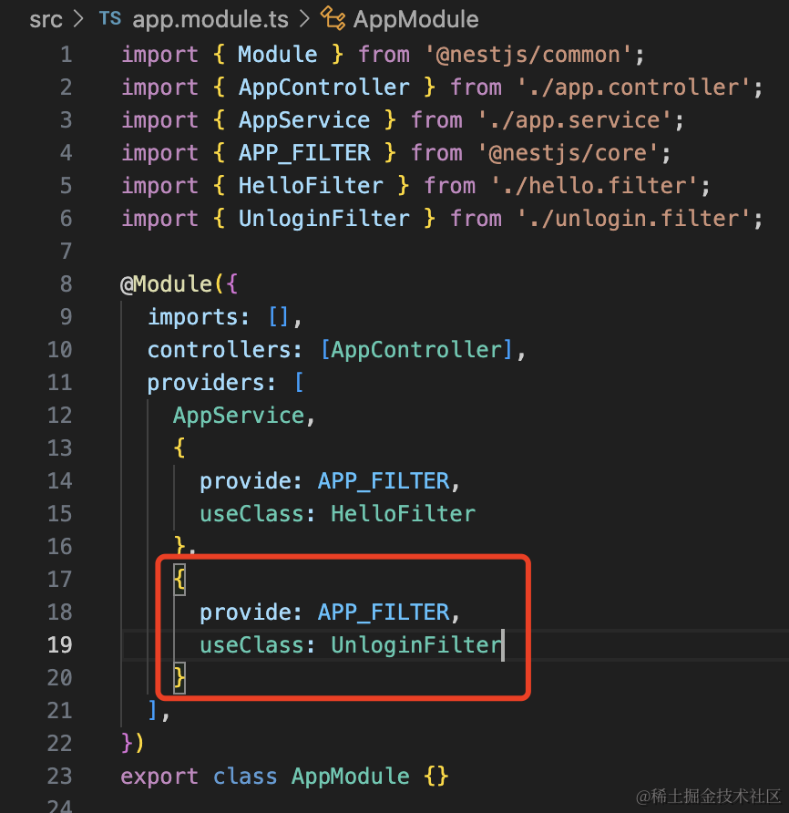

```javascript
{
  provide: APP_FILTER,
  useClass: UnloginFilter
}
```
之后在 AppController 里抛出这个异常：


浏览器里访问下：

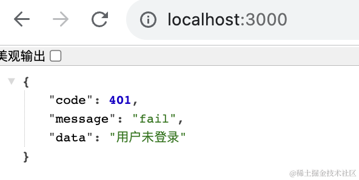

可以看到，返回的是我们自定义的格式。

也就是说，可以用自定义 Exception Filter 捕获内置的或者自定义的 Exception。

案例代码在[小册仓库](https://github.com/QuarkGluonPlasma/nestjs-course-code/tree/main/exception-filter-test)。
## 总结

这节我们学习了自定义 Exception Filter。

通过 @Catch 指定要捕获的异常，然后在 catch 方法里拿到异常信息，返回对应的响应。

如果捕获的是 HttpException，要注意兼容下 ValidationPipe 的错误格式的处理。

filter 可以通过 @UseFilters 加在 handler 或者 controller 上，也可以在 main.ts 用 app.useGlobalFilters 全局启用。

如果 filter 要注入其他 provider，就要通过 AppModule 里注册一个 token 为 APP_FILTER 的 provider 的方式。

此外，捕获的 Exception 也是可以自定义的。

这样，我们就可以自定义异常和异常返回的响应格式了。