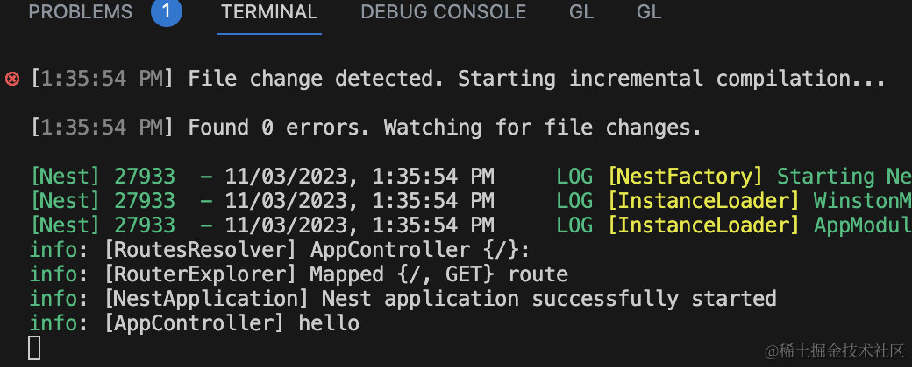
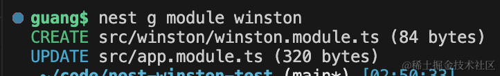
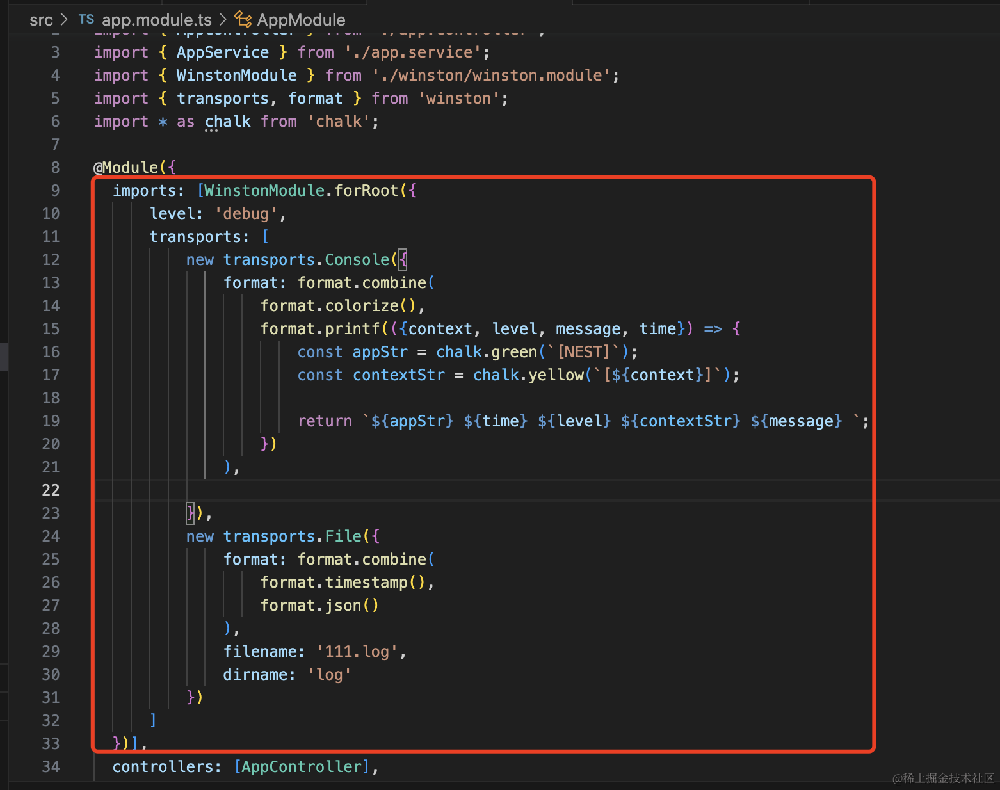
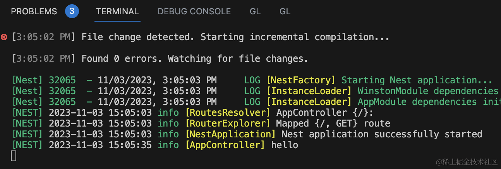

我们学习了 Nest 如何自定义 logger，也学习了 Winston 的使用。

那如何在 Nest 里集成 Winston 呢？

这节我们来实现下。

```
nest new nest-winston-test
```


创建个 nest 项目。

在 src 添加一个 MyLogger.ts

```javascript
import { LoggerService, LogLevel } from '@nestjs/common';

export class MyLogger implements LoggerService {
    log(message: string, context: string) {
        console.log(`---log---[${context}]---`, message)
    }

    error(message: string, context: string) {
        console.log(`---error---[${context}]---`, message)
    }

    warn(message: string, context: string) {
        console.log(`---warn---[${context}]---`, message)
    }
}
```
然后在 main.ts 里引入：


```javascript
app.useLogger(new MyLogger());
```
把服务跑起来：

```
npm run start:dev
```


现在的 logger 就换成我们自己的了。

然后在 AppController 里添加 logger：


浏览器访问下：


这样就完成了 logger 的自定义。

接下来只要换成 winston 的 logger 就好了。

安装 winston：

```
npm install --save  winston
```

然后改下 MyLogger：

```javascript
import { ConsoleLogger, LoggerService, LogLevel } from '@nestjs/common';
import { createLogger, format, Logger, transports } from 'winston';

export class MyLogger implements LoggerService {

    private logger: Logger;

    constructor() {    
        this.logger = createLogger({
            level: 'debug',
            format: format.combine(
                format.colorize(),
                format.simple()
            ),
            transports: [
                new transports.Console()
            ]
        });
    }

    log(message: string, context: string) {
        this.logger.log('info', `[${context}] ${message}`);
    }

    error(message: string, context: string) {
        this.logger.log('error', `[${context}] ${message}`);
    }

    warn(message: string, context: string) {
        this.logger.log('warn', `[${context}] ${message}`);
    }
}
```
把 console.log 换成 winston 的 logger。

再跑下：



现在的日志就是 winston 的了。

只不过和 nest 原本的日志格式不大一样。

这个简单，我们自己写一下这种格式就好了。

安装 dayjs 格式化日期：

```
npm install --save dayjs
```
安装 chalk 来打印颜色：

```
npm install --save chalk@4
```
注意：这里用的是 chalk 4.x 的版本。

然后来实现下 nest 日志的格式：

```javascript
import { ConsoleLogger, LoggerService, LogLevel } from '@nestjs/common';
import * as chalk from 'chalk';
import * as dayjs from 'dayjs';
import { createLogger, format, Logger, transports } from 'winston';

export class MyLogger implements LoggerService {

    private logger: Logger;

    constructor() {
        super();
    
        this.logger = createLogger({
            level: 'debug',
            transports: [
                new transports.Console({
                    format: format.combine(
                        format.colorize(),
                        format.printf(({context, level, message, time}) => {
                            const appStr = chalk.green(`[NEST]`);
                            const contextStr = chalk.yellow(`[${context}]`);
        
                            return `${appStr} ${time} ${level} ${contextStr} ${message} `;
                        })
                    ),
                })
            ]
        });
    }

    log(message: string, context: string) {
        const time = dayjs(Date.now()).format('YYYY-MM-DD HH:mm:ss');

        this.logger.log('info', message, { context, time });
    }

    error(message: string, context: string) {
        const time = dayjs(Date.now()).format('YYYY-MM-DD HH:mm:ss');

        this.logger.log('info', message, { context, time });
    }

    warn(message: string, context: string) {
        const time = dayjs(Date.now()).format('YYYY-MM-DD HH:mm:ss');

        this.logger.log('info', message, { context, time });
    }
}
```

这里用到了 printf 的 format 函数，它可以自定义打印的日志格式。

我们用 chalk 加上了颜色，并且打印了 dayjs 格式化的时间。

效果是这样的：


是不是和 nest 原本的日志很像了？

然后我们再加一个 File 的 transport。


指定为 json 格式，加上时间戳：

```javascript
new transports.File({
    format: format.combine(
        format.timestamp(),
        format.json()
    ),
    filename: '111.log',
    dirname: 'log'
})
```

console 的日志是这样的：


file 的日志是这样的：


这样，我们就完成了 nest 和 winston 的集成。

我们还可以进一步把它封装成一个动态模块。



```javascript
import { DynamicModule, Global, Module } from '@nestjs/common';
import { LoggerOptions, createLogger } from 'winston';
import { MyLogger } from './MyLogger';

export const WINSTON_LOGGER_TOKEN = 'WINSTON_LOGGER';

@Global()
@Module({})
export class WinstonModule {

    public static forRoot(options: LoggerOptions): DynamicModule {    
        return {
            module: WinstonModule,
            providers: [
                {
                    provide: WINSTON_LOGGER_TOKEN,
                    useValue: new MyLogger(options)
                }
            ],
            exports: [
                WINSTON_LOGGER_TOKEN
            ]
        };
      }
}

```

添加 forRoot 方法，接收 winston 的 createLogger 方法的参数，返回动态模块的 providers、exports。

用 useValue 创建 logger 对象作为 provider。

这里的 MyLogger 是之前那个复制过来的，但需要改一下 constructor：


```javascript
constructor(options) {    
    this.logger = createLogger(options)
}
```
然后在 AppModule 引入下：



```javascript
import { Module } from '@nestjs/common';
import { AppController } from './app.controller';
import { AppService } from './app.service';
import { WinstonModule } from './winston/winston.module';
import { transports, format } from 'winston';
import * as chalk from 'chalk';

@Module({
  imports: [WinstonModule.forRoot({
      level: 'debug',
      transports: [
          new transports.Console({
              format: format.combine(
                  format.colorize(),
                  format.printf(({context, level, message, time}) => {
                      const appStr = chalk.green(`[NEST]`);
                      const contextStr = chalk.yellow(`[${context}]`);
  
                      return `${appStr} ${time} ${level} ${contextStr} ${message} `;
                  })
              ),

          }),
          new transports.File({
              format: format.combine(
                  format.timestamp(),
                  format.json()
              ),
              filename: '111.log',
              dirname: 'log'
          })
      ]
  })],
  controllers: [AppController],
  providers: [AppService],
})
export class AppModule {}

```

之后改一下 main.ts 里用的 logger：


```javascript
app.useLogger(app.get(WINSTON_LOGGER_TOKEN));
```
功能正常：



只不过现在就没必要每次都 new 了：


改成 inject 的方式，始终使用同一个实例，性能更好：

```javascript
@Inject(WINSTON_LOGGER_TOKEN)
private logger;
```
案例代码在[小册仓库](https://github.com/QuarkGluonPlasma/nestjs-course-code/tree/main/nest-winston-test)。
## 总结

这节我们集成了 nest 和 winston。

前面我们学过了如何自定义 Nest 的 logger，现在只要在 Logger 的实现里改成 winston 的 logger 就好了。

只是想要保持 nest 原本日志的格式，需要用 printf 自定义。我们使用 dayjs + chalk 自定义了 winston 的日志格式。

当然，打印到 File 的日志，依然是 json 的。

之后封装了个动态模块，在 forRoot 方法里传入 options，模块内创建 winston 的 logger 实例。并且这个模块声明为全局模块。

这样，在应用的各处都可以注入我们自定义的基于 winston 的 logger 了。
