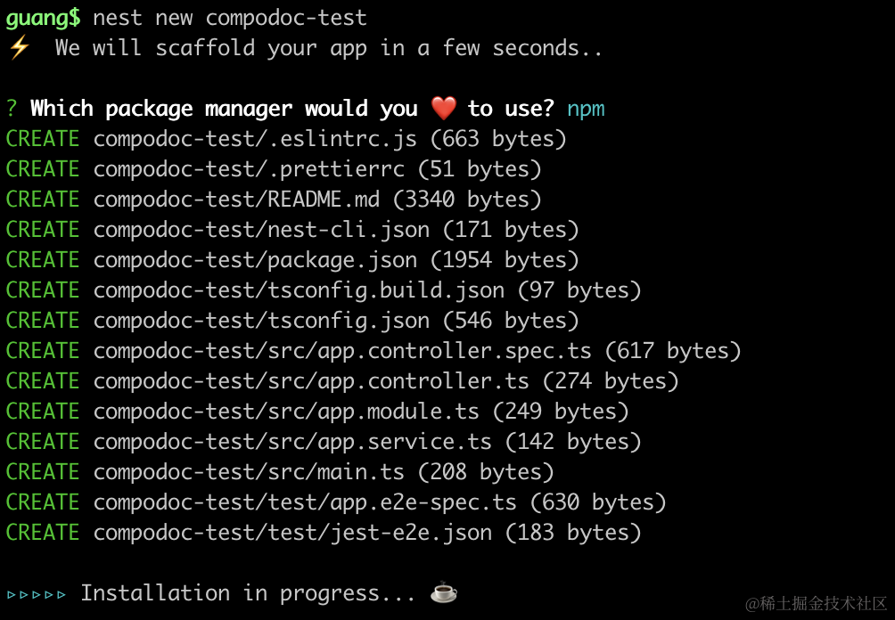
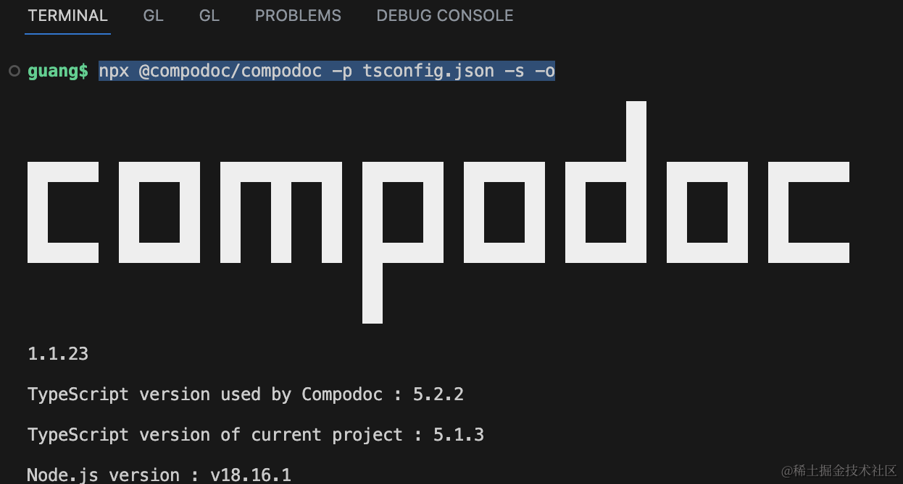
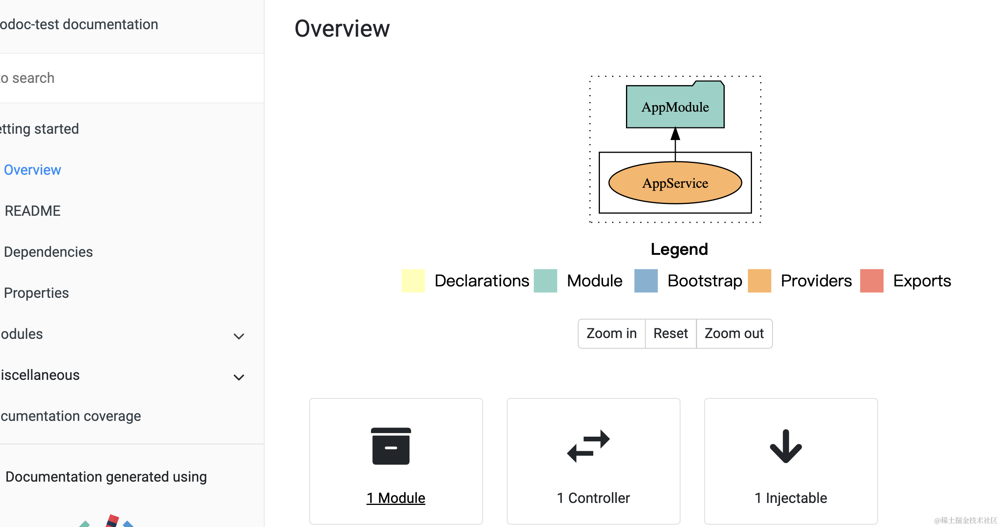
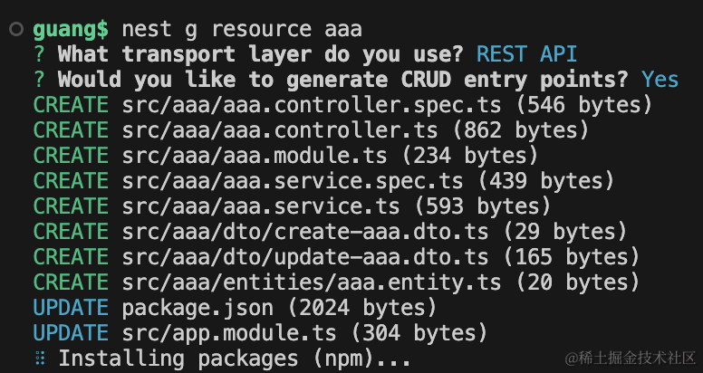
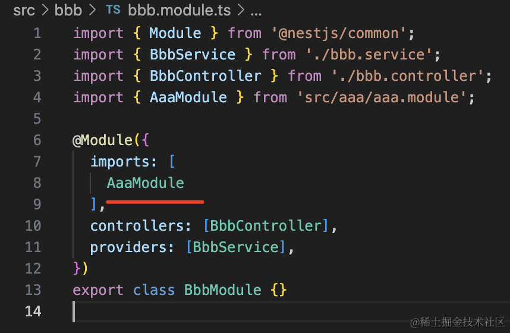
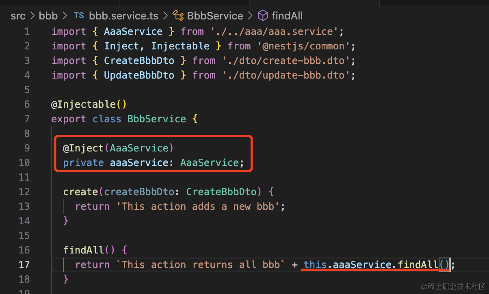
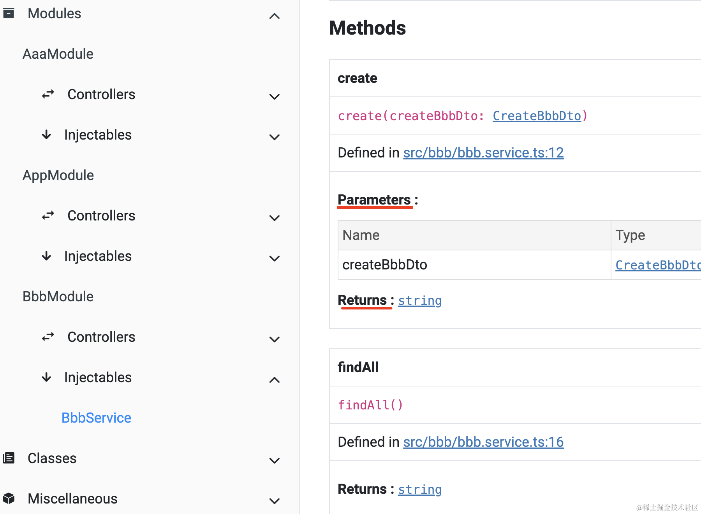

Nest 项目会有很多模块，模块之间相互依赖，模块内有 controller、service 等。

当项目复杂之后，模块之间的关系错综复杂。

这时候我们可以用 compodoc 生成一份文档，把依赖关系可视化。

compodoc 本来是给 angular 项目生成项目文档的，但是因为 angular 和 nest 项目结构类似，所以也支持了 nest。

我们创建个项目：

```
nest new compodoc-test
```



安装 compodoc：

```
npm install --save-dev @compodoc/compodoc
```
然后生成一份文档：

```
npx @compodoc/compodoc -p tsconfig.json -s -o
```



这个 README 就是项目下的 README.md:


改一下 READMD.md，然后重新执行命令生成：


可以看到页面上的也变了：


overview 部分上面是依赖图，下面是项目有几个模块、controller，可注入的 provider



我们在项目下加几个模块：

```
nest g resource aaa

nest g resource bbb
```




在 AaaModule 里把 AaaService 导出：


然后 BbbModule 引入 AaaModule：



在 BbbService 里注入 AaaService：
 


先跑起来看一下：

```
npm run start:dev
```


没啥问题：


类似这种依赖关系，compodoc 可视化之后是什么样的呢？

重新跑一下 compodoc：
```
npx @compodoc/compodoc -p tsconfig.json -s -o
```
依赖可视化是这样的：


用不同的颜色表示 Module、Provider、Exports 等。

可以看到 AppModule 引入了 AaaModule、BbbModule。

AaaModule 导出了 AaaService。

以及每个模块的 provider。

都可以可视化的看到。

点击左侧的 Modules，可以看到每个模块的可视化分析：

AaaModule：


BbbModule：


AppModule：


当然，我们这个例子还是比较简单，当项目依赖复杂之后，这个可视化还是比较有用的。

此外，可以看到每个 Controller、Service 或者其他的 class 的属性、方法，点进去可以看到方法的参数、返回值等：




当新人接手这个项目的时候，可以通过这份文档快速了解项目的结构。

回过头来，我们看下 compodoc 的一些 cli 选项：

```
npx @compodoc/compodoc -p tsconfig.json -s -o
```

-p 是指定 tsconfig 文件

-s 是启动静态服务器

-o 是打开浏览器

更多选项在 [compodoc 文档](https://compodoc.app/guides/options.html)里可以看到:


比如 --theme 可以指定主题，一共有 gitbook,aravel, original, material, postmark, readthedocs, stripe, vagrant 这 8 个主题：

跑一下：
```
npx @compodoc/compodoc -p tsconfig.json -s -o --theme postmark
```

可以看到文档主题换了：


选项还是挺多的，如果都写在命令行也不现实，compodoc 同样支持配置文件。

我们在项目下添加一个 .compodoc.json 的文件：

```json
{
    "port": 8888,
    "theme": "postmark"
}
```

然后再跑下 compodoc：

```
npx @compodoc/compodoc -p tsconfig.json -s -o -c .compodoc.json
```

可以看到，配置生效了：


文档里写的这些 cli options，基本都可以写在配置文件里。


不过一般也不咋用配置。

案例代码上传了[小册仓库](https://github.com/QuarkGluonPlasma/nestjs-course-code/tree/main/compodoc-test)。

## 总结

我们学习了用 compodoc 生成 nest 项目的文档，它会列出项目的模块，可视化展示模块之间的依赖关系，展示每个模块下的 provider、exports 等。

对于新人接手项目来说，还是比较有用的。

而且可视化分析依赖和模块结构，对于复杂项目来说，是比较有帮助的。

compodoc 算是一个不错的 nest 相关的工具。
