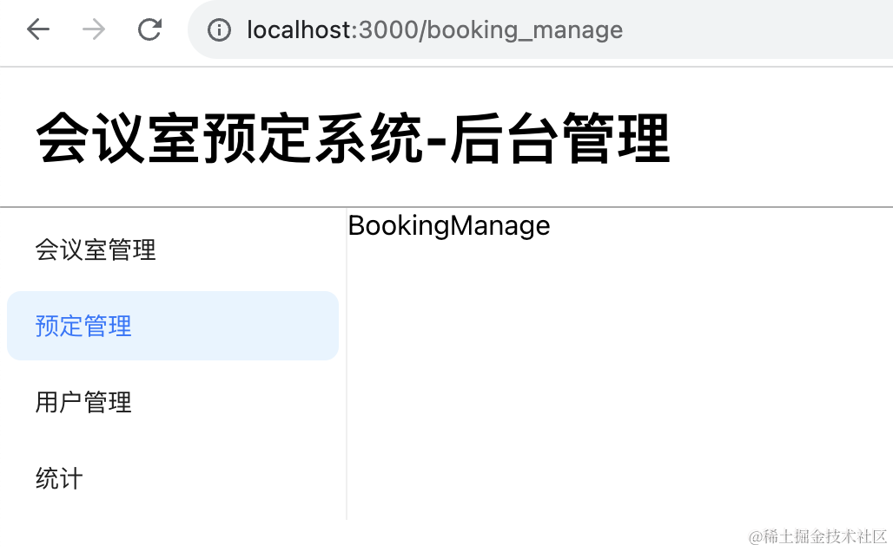
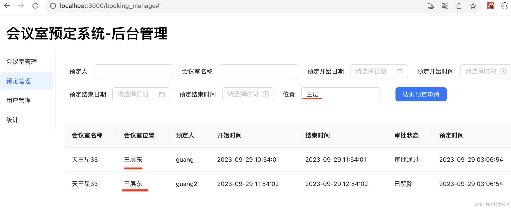
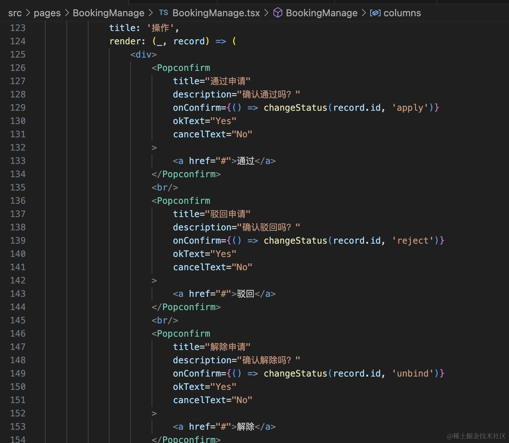

这节写下预定管理模块管理端的前端部分：


对应的路由我们前面写过了：



这节来填充下内容。

首先是 table 部分：

```javascript
import { Badge, Button, DatePicker, Form, Input, Popconfirm, Table, TimePicker, message } from "antd";
import { useEffect, useState } from "react";
import { ColumnsType } from "antd/es/table";
import { UserSearchResult } from "../UserManage/UserManage";
import { MeetingRoomSearchResult } from "../MeetingRoomManage/MeetingRoomManage";
import dayjs from "dayjs";

interface BookingSearchResult {
    id: number;
    startTime: string;
    endTime: string;
    status: string;
    note: string;
    createTime: string;
    updateTime: string;
    user: UserSearchResult,
    room: MeetingRoomSearchResult
}

export function BookingManage() {
    const [pageNo, setPageNo] = useState<number>(1);
    const [pageSize, setPageSize] = useState<number>(10);
    const [bookingSearchResult] = useState<Array<BookingSearchResult>>([]);

    const columns: ColumnsType<BookingSearchResult> = [
        {
            title: '会议室名称',
            dataIndex: 'room',
            render(_, record) {
                return record.room.name
            }
        },
        {
            title: '会议室位置',
            dataIndex: 'room',
            render(_, record) {
                return record.room.location
            }
        },
        {
            title: '预定人',
            dataIndex: 'user',
            render(_, record) {
                return record.user.username
            }
        },
        {
            title: '开始时间',
            dataIndex: 'startTime',
            render(_, record) {
                return dayjs(new Date(record.startTime)).format('YYYY-MM-DD HH:mm:ss')
            }
        },
        {
            title: '结束时间',
            dataIndex: 'endTime',
            render(_, record) {
                return dayjs(new Date(record.endTime)).format('YYYY-MM-DD HH:mm:ss')
            }
        },
        {
            title: '审批状态',
            dataIndex: 'status'
        },
        {
            title: '预定时间',
            dataIndex: 'createTime',
            render(_, record) {
                return dayjs(new Date(record.createTime)).format('YYYY-MM-DD hh:mm:ss')
            }
        },
        {
            title: '备注',
            dataIndex: 'note'
        },
        {
            title: '描述',
            dataIndex: 'description'
        },
        {
            title: '操作',
            render: (_, record) => (
                <div>
                </div>
            )
        }
    ];


    const changePage = function(pageNo: number, pageSize: number) {
        setPageNo(pageNo);
        setPageSize(pageSize);
    }

    return <div id="bookingManage-container">
        <div className="bookingManage-table">
            <Table columns={columns} dataSource={bookingSearchResult} pagination={ {
                current: pageNo,
                pageSize: pageSize,
                onChange: changePage
            }}/>
        </div>
    </div>
}
```

列表接口是这样的：


根据这个指定表格列的定义，并且添加分页的处理。

其中涉及到的 User 和 Room 的类型从其他页面导入：


这里用到 dayjs 来格式化日期，安装下：

```
npm install dayjs
```

然后加上上面的表单：

```javascript
import { Button, DatePicker, Form, Input, Popconfirm, Table, TimePicker, message } from "antd";
import { useEffect, useState } from "react";
import { ColumnsType } from "antd/es/table";
import { useForm } from "antd/es/form/Form";
import './booking_manage.css';
import { UserSearchResult } from "../UserManage/UserManage";
import { MeetingRoomSearchResult } from "../MeetingRoomManage/MeetingRoomManage";
import dayjs from "dayjs";

export interface SearchBooking {
    username: string;
    meetingRoomName: string;
    meetingRoomPosition: string;
    rangeStartDate: Date;
    rangeStartTime: Date;
    rangeEndDate: Date;
    rangeEndTime: Date;
}

interface BookingSearchResult {
    id: number;
    startTime: string;
    endTime: string;
    status: string;
    note: string;
    createTime: string;
    updateTime: string;
    user: UserSearchResult,
    room: MeetingRoomSearchResult
}

export function BookingManage() {
    const [pageNo, setPageNo] = useState<number>(1);
    const [pageSize, setPageSize] = useState<number>(10);
    const [bookingSearchResult, setBookingSearchResult] = useState<Array<BookingSearchResult>>([]);
    const [num, setNum] = useState(0);

    const columns: ColumnsType<BookingSearchResult> = [
        {
            title: '会议室名称',
            dataIndex: 'room',
            render(_, record) {
                return record.room.name
            }
        },
        {
            title: '会议室位置',
            dataIndex: 'room',
            render(_, record) {
                return record.room.location
            }
        },
        {
            title: '预定人',
            dataIndex: 'user',
            render(_, record) {
                return record.user.username
            }
        },
        {
            title: '开始时间',
            dataIndex: 'startTime',
            render(_, record) {
                return dayjs(new Date(record.startTime)).format('YYYY-MM-DD HH:mm:ss')
            }
        },
        {
            title: '结束时间',
            dataIndex: 'endTime',
            render(_, record) {
                return dayjs(new Date(record.endTime)).format('YYYY-MM-DD HH:mm:ss')
            }
        },
        {
            title: '审批状态',
            dataIndex: 'status'
        },
        {
            title: '预定时间',
            dataIndex: 'createTime',
            render(_, record) {
                return dayjs(new Date(record.createTime)).format('YYYY-MM-DD hh:mm:ss')
            }
        },
        {
            title: '备注',
            dataIndex: 'note'
        },
        {
            title: '描述',
            dataIndex: 'description'
        },
        {
            title: '操作',
            render: (_, record) => (
                <div>
                </div>
            )
        }
    ];

    const searchBooking = async (values: SearchBooking) => {

    }

    const [form ]  = useForm();

    useEffect(() => {
        searchBooking({
            username: form.getFieldValue('username'),
            meetingRoomName: form.getFieldValue('meetingRoomName'),
            meetingRoomPosition: form.getFieldValue('meetingRoomPosition'),
            rangeStartDate: form.getFieldValue('rangeStartDate'),
            rangeStartTime: form.getFieldValue('rangeStartTime'),
            rangeEndDate: form.getFieldValue('rangeEndDate'),
            rangeEndTime: form.getFieldValue('rangeEndTime')
        });
    }, [pageNo, pageSize, num]);

    const changePage = function(pageNo: number, pageSize: number) {
        setPageNo(pageNo);
        setPageSize(pageSize);
    }

    return <div id="bookingManage-container">
        <div className="bookingManage-form">
            <Form
                form={form}
                onFinish={searchBooking}
                name="search"
                layout='inline'
                colon={false}
            >
                <Form.Item label="预定人" name="username">
                    <Input />
                </Form.Item>

                <Form.Item label="会议室名称" name="meetingRoomName">
                    <Input />
                </Form.Item>

                <Form.Item label="预定开始日期" name="rangeStartDate">
                    <DatePicker/>
                </Form.Item>

                <Form.Item label="预定开始时间" name="rangeStartTime">
                    <TimePicker/>
                </Form.Item>

                <Form.Item label="预定结束日期" name="rangeEndDate">
                    <DatePicker/>
                </Form.Item>

                <Form.Item label="预定结束时间" name="rangeEndTime">
                    <TimePicker/>
                </Form.Item>

                <Form.Item label="位置" name="meetingRoomPosition">
                    <Input />
                </Form.Item>

                <Form.Item label=" ">
                    <Button type="primary" htmlType="submit">
                        搜索预定申请
                    </Button>
                </Form.Item>
            </Form>
        </div>
        <div className="bookingManage-table">
            <Table columns={columns} dataSource={bookingSearchResult} pagination={ {
                current: pageNo,
                pageSize: pageSize,
                onChange: changePage
            }}/>
        </div>
    </div>
}
```
涉及到的 css 如下：

```css
#bookingManage-container {
    padding: 20px;
}
#bookingManage-container .bookingManage-form {
    margin-bottom: 40px;
}
#bookingManage-container .ant-form-item {
    margin: 10px;
}

```

渲染出来是这样的：


这里要注意的是日期和时间分别要用 DatePicker 和 TimePicker，所以分为 2 个字段。

接下来实现下用到的接口，改下 interfaces.ts

```javascript
export async function bookingList(searchBooking: SearchBooking, pageNo: number, pageSize: number) {

    let bookingTimeRangeStart;
    let bookingTimeRangeEnd;
    
    if(searchBooking.rangeStartDate && searchBooking.rangeStartTime) {
        const rangeStartDateStr = dayjs(searchBooking.rangeStartDate).format('YYYY-MM-DD');
        const rangeStartTimeStr = dayjs(searchBooking.rangeStartTime).format('HH:mm');
        bookingTimeRangeStart = dayjs(rangeStartDateStr + ' ' + rangeStartTimeStr).valueOf()
    }

    if(searchBooking.rangeEndDate && searchBooking.rangeEndTime) {
        const rangeEndDateStr = dayjs(searchBooking.rangeEndDate).format('YYYY-MM-DD');
        const rangeEndTimeStr = dayjs(searchBooking.rangeEndTime).format('HH:mm');
        bookingTimeRangeEnd = dayjs(rangeEndDateStr + ' ' + rangeEndTimeStr).valueOf()
    }

    return await axiosInstance.get('/booking/list', {
        params: {
            username: searchBooking.username,
            meetingRoomName: searchBooking.meetingRoomName,
            meetingRoomPosition: searchBooking.meetingRoomPosition,
            bookingTimeRangeStart,
            bookingTimeRangeEnd,
            pageNo: pageNo,
            pageSize: pageSize
        }
    });
}

export async function apply(id: number) {
    return await axiosInstance.get('/booking/apply/' + id);
}

export async function reject(id: number) {
    return await axiosInstance.get('/booking/reject/' + id);
}

export async function unbind(id: number) {
    return await axiosInstance.get('/booking/unbind/' + id);
}
```

apply、reject、unbind 接口比较简单，列表接口相对麻烦一些。

因为现在日期和时间分为了 2 个字段，而接口只接收一个字段，所以要把它们合并。

用 dayjs 分别把日期和时间 format 成 YYYY-MM-DD 和 HH:mm 的格式。

然后拼接成一个字符串之后，再创建 dayjs 实例，这样时间就合并成一个了。

在页面里调用下列表接口：


```javascript
import { Button, DatePicker, Form, Input, Popconfirm, Table, TimePicker, message } from "antd";
import { useEffect, useState } from "react";
import { ColumnsType } from "antd/es/table";
import { useForm } from "antd/es/form/Form";
import { apply, bookingList, reject, unbind } from "../../interfaces/interfaces";
import './booking_manage.css';
import { UserSearchResult } from "../UserManage/UserManage";
import { MeetingRoomSearchResult } from "../MeetingRoomManage/MeetingRoomManage";
import dayjs from "dayjs";

export interface SearchBooking {
    username: string;
    meetingRoomName: string;
    meetingRoomPosition: string;
    rangeStartDate: Date;
    rangeStartTime: Date;
    rangeEndDate: Date;
    rangeEndTime: Date;
}

interface BookingSearchResult {
    id: number;
    startTime: string;
    endTime: string;
    status: string;
    note: string;
    createTime: string;
    updateTime: string;
    user: UserSearchResult,
    room: MeetingRoomSearchResult
}

export function BookingManage() {
    const [pageNo, setPageNo] = useState<number>(1);
    const [pageSize, setPageSize] = useState<number>(10);
    const [bookingSearchResult, setBookingSearchResult] = useState<Array<BookingSearchResult>>([]);
    const [num, setNum] = useState(0);

    const columns: ColumnsType<BookingSearchResult> = [
        {
            title: '会议室名称',
            dataIndex: 'room',
            render(_, record) {
                return record.room.name
            }
        },
        {
            title: '会议室位置',
            dataIndex: 'room',
            render(_, record) {
                return record.room.location
            }
        },
        {
            title: '预定人',
            dataIndex: 'user',
            render(_, record) {
                return record.user.username
            }
        },
        {
            title: '开始时间',
            dataIndex: 'startTime',
            render(_, record) {
                return dayjs(new Date(record.startTime)).format('YYYY-MM-DD HH:mm:ss')
            }
        },
        {
            title: '结束时间',
            dataIndex: 'endTime',
            render(_, record) {
                return dayjs(new Date(record.endTime)).format('YYYY-MM-DD HH:mm:ss')
            }
        },
        {
            title: '审批状态',
            dataIndex: 'status',
        },
        {
            title: '预定时间',
            dataIndex: 'createTime',
            render(_, record) {
                return dayjs(new Date(record.createTime)).format('YYYY-MM-DD hh:mm:ss')
            }
        },
        {
            title: '备注',
            dataIndex: 'note'
        },
        {
            title: '描述',
            dataIndex: 'description'
        },
        {
            title: '操作',
            render: (_, record) => (
                <div>
                    
                </div>
            )
        }
    ];

    const searchBooking = async (values: SearchBooking) => {
        const res = await bookingList(values, pageNo, pageSize);

        const { data } = res.data;
        if(res.status === 201 || res.status === 200) {
            setBookingSearchResult(data.bookings.map((item: BookingSearchResult) => {
                return {
                    key: item.id,
                    ...item
                }
            }))
        } else {
            message.error(data || '系统繁忙，请稍后再试');
        }
    }

    const [form ]  = useForm();

    useEffect(() => {
        searchBooking({
            username: form.getFieldValue('username'),
            meetingRoomName: form.getFieldValue('meetingRoomName'),
            meetingRoomPosition: form.getFieldValue('meetingRoomPosition'),
            rangeStartDate: form.getFieldValue('rangeStartDate'),
            rangeStartTime: form.getFieldValue('rangeStartTime'),
            rangeEndDate: form.getFieldValue('rangeEndDate'),
            rangeEndTime: form.getFieldValue('rangeEndTime')
        });
    }, [pageNo, pageSize, num]);

    const changePage = function(pageNo: number, pageSize: number) {
        setPageNo(pageNo);
        setPageSize(pageSize);
    }

    return <div id="bookingManage-container">
        <div className="bookingManage-form">
            <Form
                form={form}
                onFinish={searchBooking}
                name="search"
                layout='inline'
                colon={false}
            >
                <Form.Item label="预定人" name="username">
                    <Input />
                </Form.Item>

                <Form.Item label="会议室名称" name="meetingRoomName">
                    <Input />
                </Form.Item>

                <Form.Item label="预定开始日期" name="rangeStartDate">
                    <DatePicker/>
                </Form.Item>

                <Form.Item label="预定开始时间" name="rangeStartTime">
                    <TimePicker/>
                </Form.Item>

                <Form.Item label="预定结束日期" name="rangeEndDate">
                    <DatePicker/>
                </Form.Item>

                <Form.Item label="预定结束时间" name="rangeEndTime">
                    <TimePicker/>
                </Form.Item>

                <Form.Item label="位置" name="meetingRoomPosition">
                    <Input />
                </Form.Item>

                <Form.Item label=" ">
                    <Button type="primary" htmlType="submit">
                        搜索预定申请
                    </Button>
                </Form.Item>
            </Form>
        </div>
        <div className="bookingManage-table">
            <Table columns={columns} dataSource={bookingSearchResult} pagination={ {
                current: pageNo,
                pageSize: pageSize,
                onChange: changePage
            }}/>
        </div>
    </div>
}
```

没带参数的搜索没问题：


数据库里就这 4 条记录：


然后带上参数搜索下：





开始时间在 2023-9-29 的 10 点到 11 点的预定有 3 条：


11 点到 12 点的有 1 条：


这样，列表功能就完成了。

可以再加上个按照状态过滤，这个是 antd 的功能：


```javascript
{
    title: '审批状态',
    dataIndex: 'status',
    onFilter: (value, record) => record.status.startsWith(value as string),
    filters: [
        {
          text: '审批通过',
          value: '审批通过',
        },
        {
          text: '审批驳回',
          value: '审批驳回',
        },
        {
            text: '申请中',
            value: '申请中',
        },
        {
            text: '已解除',
            value: '已解除'
        },
      ],
},
```


然后加上右边的按钮：



```javascript
{
    title: '操作',
    render: (_, record) => (
        <div>
            <Popconfirm
                title="通过申请"
                description="确认通过吗？"
                onConfirm={() => changeStatus(record.id, 'apply')}
                okText="Yes"
                cancelText="No"
            >  
                <a href="#">通过</a>
            </Popconfirm>
            <br/>
            <Popconfirm
                title="驳回申请"
                description="确认驳回吗？"
                onConfirm={() => changeStatus(record.id, 'reject')}
                okText="Yes"
                cancelText="No"
            >  
                <a href="#">驳回</a>
            </Popconfirm>
            <br/>
            <Popconfirm
                title="解除申请"
                description="确认解除吗？"
                onConfirm={() => changeStatus(record.id, 'unbind')}
                okText="Yes"
                cancelText="No"
            >  
                <a href="#">解除</a>
            </Popconfirm>
            <br/>
        </div>
    )
}
```

```javascript
async function changeStatus(id: number, status: 'apply' | 'reject' | 'unbind') {
    const methods = {
        apply,
        reject,
        unbind
    }
    const res = await methods[status](id);

    if(res.status === 201 || res.status === 200) {
        message.success('状态更新成功');
        setNum(Math.random());
    } else {
        message.error(res.data.data);
    }
}
```
更新完状态之后要触发列表的重新渲染，所以这里用 setNum 触发：


这样，预定管理的功能就完成了。

案例代码上传了[小册仓库](https://github.com/QuarkGluonPlasma/nestjs-course-code/tree/main/meeting_room_booking_system_backend)

## 总结

这节我们实现了预订管理的管理端的前端页面，主要是列表和修改状态的接口。

要注意的是时间相关的处理，antd 只有 DatePicker 和 TimePicker，我们要添加 2 个字段接收，然后调用接口的时候把它们合并成一个字段。

下节我们来写用户端的部分。

